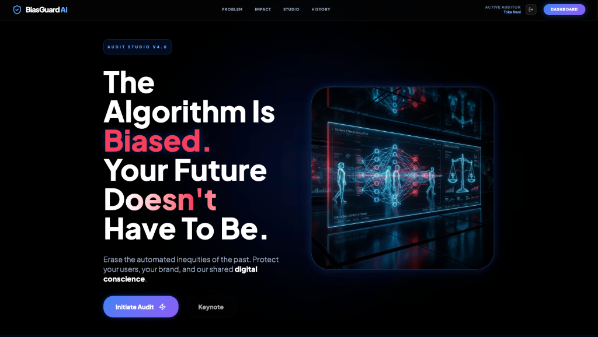
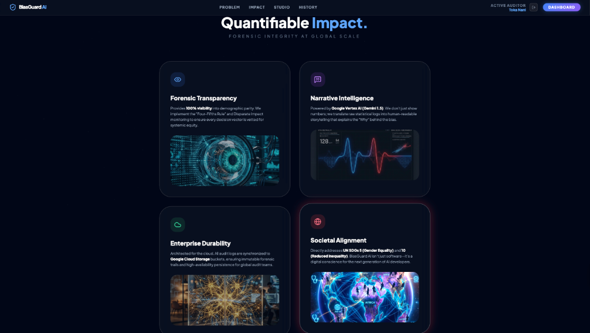
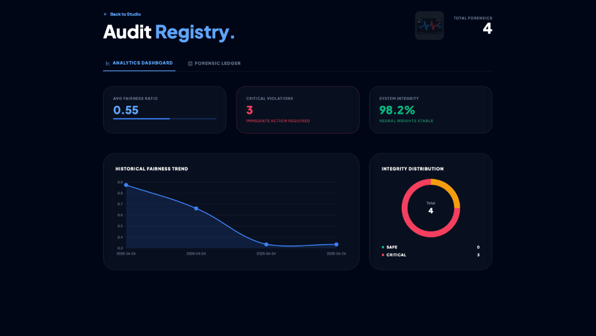
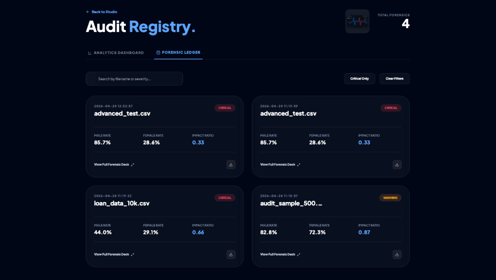

# 🛡️ BiasGuard AI: Unbiased AI Decision
> **Erase Automated Inequities. Protect the Digital Conscience.**

[](https://developers.google.com/community/solutions-challenge)
[](https://deepmind.google/technologies/gemini/)

---

## ❗ The Problem: Automated Injustice at Scale
In our rapidly digitizing world, millions of essential decisions—from hiring and finance to healthcare—are now governed by algorithms. However, these "black boxes" often inherit and amplify historical prejudices. 
- **The Result**: Systemic exclusion of protected groups and the institutionalization of bias under the guise of "objective" data.
- **The Crisis**: 2026 is seeing a massive trust deficit in AI, where developers lack the tools to translate raw statistical disparities into actionable forensic insights.

## 💡 The Solution: BiasGuard AI
**BiasGuard AI** is a professional-grade forensic auditing platform designed to turn the "Black Box" of AI into a "Glass House" of accountability. Built entirely on the **Google Cloud Ecosystem**, it allows developers to upload decision logs and instantly generate high-fidelity fairness reports.

---

## ⚙️ Core Features
- **🔬 Forensic Audit Studio**: A high-impact drag-and-drop workspace to analyze ML decision logs (.csv).
- **🧠 Narrative Intelligence**: Powered by **Google Gemini 1.5 Flash**. We don't just show numbers; we provide human-readable storytelling that explains the "Why" behind the bias.
- **📊 Interactive Analytics**: Real-time Chart.js visualizations including Fairness Gauges, Trend Lines, and Integrity Distribution charts.
- **📜 Integrated Audit Registry**: A secure, persistent history of all forensic audits linked to your user profile.
- **🛡️ Enterprise-Grade Auth**: Secure auditor login and signup system with demographic metadata capture.
- **📄 One-Click Audit Reports**: Instant professional PDF generation for corporate compliance and transparency.

---

## 🧠 AI & Cloud Architecture
BiasGuard is architected for global scale and immutable data integrity.

- **Google Vertex AI (Gemini 1.5)**: Used for forensic reasoning and translating disparate impact ratios into actionable retraining strategies.
- **Google Cloud Run**: Provides a serverless, auto-scaling backend for the Flask API.
- **Google Cloud Storage**: Ensures every forensic audit trail is immutably stored in private partitions.
- **Google Firestore**: Handles real-time synchronization of audit history across global territories.

---

## 📊 Visual Walkthrough


### The Forensic Studio


### Narrative Insights & Dashboard


### Audit History & Ledger


---

## 🌍 UN Sustainable Development Impact
BiasGuard AI is directly aligned with the **United Nations 2030 Agenda**:
- **Goal 5 (Gender Equality)**: Identifying and eliminating sexism in automated hiring and financial algorithms.
- **Goal 10 (Reduced Inequality)**: Protecting underserved communities from profile-based redlining and algorithmic exclusion.

---

## 🛠️ Tech Stack
| Layer | Technologies |
| :--- | :--- |
| **Backend** | Python 3.11, Flask, SQLite / Firestore |
| **Frontend** | HTML5, Vanilla CSS, Tailwind CSS, Lucide Icons |
| **Intelligence** | Google Vertex AI (Gemini 1.5 Flash) |
| **Analytics** | Chart.js, PDF.js |
| **Infrastructure** | Google Cloud Run, Cloud Storage, Docker |

---

## ⚡ How to Run Locally

1. **Clone & Enter**
   ```bash
   git clone https://github.com/yourusername/unbiased-ai-decision.git
   cd unbiased-ai-decision
   ```

2. **Environment Setup**
   ```bash
   python -m venv venv
   source venv/bin/activate
   pip install -r requirements.txt
   ```

3. **Configure API Keys**
   Add your `GOOGLE_CLOUD_PROJECT` to your environment variables.

4. **Launch**
   ```bash
   python app.py
   ```
   Access at `http://127.0.0.1:5000`

---

## 🎯 Future Scope
- **Live Stream Integration**: Real-time monitoring for high-frequency trading and live hiring pipelines.
- **Third-Party API Wrappers**: One-click bias testing for models hosted on HuggingFace and Vertex AI Model Registry.
- **Cross-Demographic Intersectionality**: Deeper analysis into overlapping bias (e.g., race + gender).

---

## 👨‍💻 Author
**TOKA NANI**  
*Built with ❤️ for the 2026 Google Solution Challenge*

[](https://www.linkedin.com/in/toka-nani-33a124359/)
[](your_link)
